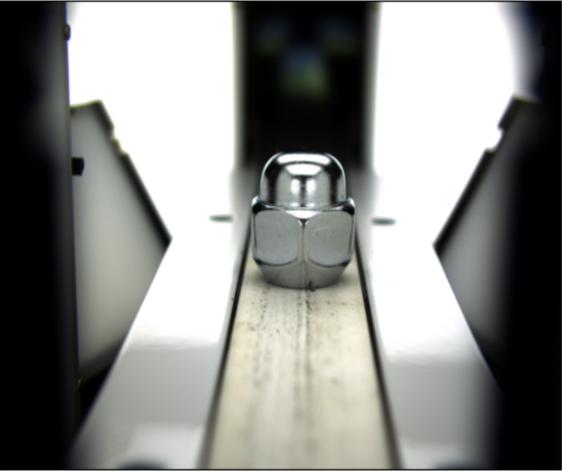
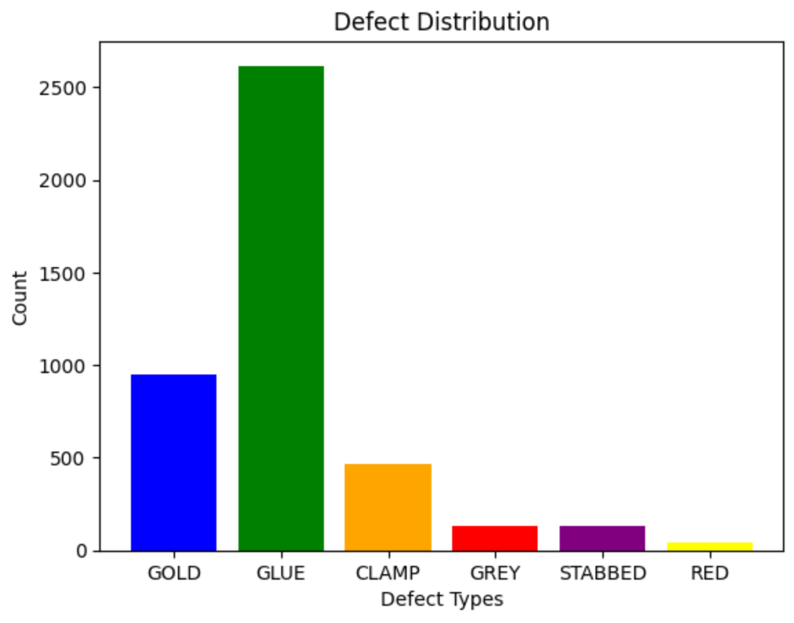

# Defect Detection using Segmentation

Sample image and corresponding defect mask

## Introduction

This documentation outlines the work I have done to address the defect detection task as part of the job assignment. 
The goal of this task was to develop a model capable of detecting defect regions in images. 
This document provides an overview of the approach, methodology, results, and the tools utilized throughout the process.
Step-by-step approaches to improve the model performance in terms of Mean IOU (according to the request) is provided.

## Task Overview

The task to s

## Approach

### Data Preparation

1. **Dataset:** Describe the dataset used for the task. Specify the number of images, resolution, and any data augmentation techniques employed.

2. **Labeling:** Explain how the ground truth labels for damaged regions were obtained. Specify if manual labeling, annotation tools, or other methods were used.

### Model Architecture

1. **Choice of Model:** Detail the architecture of the segmentation model chosen for the task. Explain the rationale behind the choice and provide references if applicable.

2. **Preprocessing:** Describe any preprocessing steps applied to the images before feeding them into the model. Include information about resizing, normalization, or any other transformations.

### Training

1. **Loss Function:** Specify the loss function used for training the model. If class weights were employed, explain how they were calculated.

2. **Optimizer:** Detail the optimizer chosen and its hyperparameters. Explain any learning rate schedules used during training.

3. **Training Procedure:** Describe the training process, including the number of epochs, batch size, and any early stopping mechanisms employed.

## Results

### Evaluation Metrics

1. **Metrics Chosen:** Specify the evaluation metrics used to assess the performance of the model. Common metrics include Intersection over Union (IoU), Dice Coefficient, and pixel accuracy.

2. **Quantitative Results:** Present the quantitative results achieved on both the validation and test datasets. Include average metrics and metrics for each class if applicable.

### Qualitative Results

1. **Visualizations:** Showcase visual examples of the model's predictions. Compare the predicted segmentation masks with the ground truth to demonstrate the quality of the segmentations.

## Conclusion

Summarize the key points of the work done for the damage segmentation task. Highlight the strengths of the approach and discuss any challenges faced during the process.

## Future Improvements

Suggest possible improvements that could enhance the performance of the segmentation model or address any limitations encountered during the task.

## Tools Used

List the tools, frameworks, and libraries used throughout the project (e.g., Python, PyTorch, OpenCV).

## Acknowledgments

Acknowledge any datasets, resources, or references that were instrumental in completing the task.
