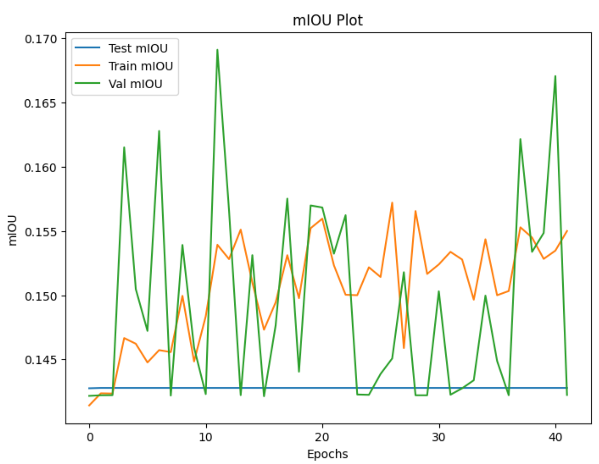

# Defect Detection

<div align="center">

<p><b>Figure 1.</b> Sample image (on the right) and corresponding defect mask(on the left)</p>
</div>

## Introduction

This documentation outlines the work I have done to address the defect detection task as part of the job assignment.
The goal of this task was to develop a model capable of detecting defect regions in images.
This document provides an overview of the approach, methodology, results, and the tools utilized throughout the process.
Step-by-step approaches to improve the model performance in terms of Mean IOU is provided.

## Approach

### Data Preparation

1. **Dataset:** The given dataset has **653** images of object and their corresponding labels. While inspecting the
   given
   samples, I found a duplicate image and after removing that a duplicate image there left **652** images. From **652**
   images there were 4 images for evaluation (shown in `NewDataInfo.txt`). (⚠️ - quite small number samples for
   evaluation)

   <div align="center">
   
   <p><b>Figure 2.</b><code>X-axis</code>: Types of Defects, <code>Y-axis</code>: Number of Instances</p>
   </div>

   From the **Figure 2**, we can see that there is a class imbalance problem in the given dataset. There are quite small
   number of samples for `GREY`, `STABBED`, `RED` compared to other classes have. (⚠️ - class imbalance problem)
2. **Labeling:** I parsed given json files and converted them all to mask images. See the conversion code
   here: [ann2mask.py](./utils/ann2mask.py).

### Model Architecture

1. **Choice of Model:** I used famous UNet model for this task. A brief structure of this model shown in **Figure 3**.
   <div align="center">
   
   <p><b>Figure 3</b>. UNet model architecture.</p>
   </div>

    - **Why not SOTA model❓**:
        1. **Data and Resource**: Using SOTA model we might get better results on certain tasks. Hence, SOTA models come
           with complex structure and different training strategies which leads to better performance. However, they
           require
           a significant amount of labeled training data and computation power for training. If there is a large dataset
           and
           powerful hardware, training a complex model might be feasible.
        2. **Time**: Training and fine-tuning a state-of-the-art model can be time-consuming. For this reason I did not
           choose current SOTA model for this task.

    - **Why did you choose UNet❓**:
        1. **Limited Data**: There size of given labeled data is small. Therefore, using simple model and applying some
           techniques such as augmentation, regularization can help to improve the mIOU.
        2. **Computational Resources**: Simple models generally faster to train and require fewer computational
           resources.
        3. **Debugging**: Simple models are good start to understand how different techniques affect performance of the
           model.

### Training

1. **Loss Function:**
   Choosing a loss function is a crucial decision for any deep learning task. While numerous loss functions work
   perfectly for specific datasets, they might not perform well on custom datasets. Particularly, when dealing with
   real-world data, numerous challenges arise in selecting an appropriate loss function due to the data's distribution
   and nature.

   For instance, Cross Entropy Loss is commonly used as a default choice for segmentation tasks. However, if a class
   imbalance exists in the data, Cross Entropy Loss may not be the optimal selection. When encountering a class
   imbalance issue in the dataset, the following loss functions offer better alternatives. Therefore, I implemented
   these loss
   functions and subsequently compared the model's performance for each of them

- **Dice Loss** [[paper](https://arxiv.org/abs/1707.03237v3)]
- Dice + Cross Entropy Loss
- **Focal Loss** [[paper](https://arxiv.org/abs/1708.02002v2)]

2. **Optimizer:**

    - **RMSprop** (**Root Mean Square Propagation**):
        - Advantages: RMSProp **adapts the learning rates** based on the magnitudes of recent gradients. It helps
          mitigate
          the vanishing and exploding gradient problem and can lead to stable training.
        - Considerations: Like Adam, RMSProp adjusts the learning rates individually, which might **lead to aggressive
          updates in some cases.**
    - **SGD** (**Stochastic Gradient Descent**):
        - Advantages: SGD is a classic optimization algorithm. It can work well with carefully tuned learning rates and
          momentum, making it useful for fine-tuning and achieving good generalization.
        - Considerations: It might require more hyperparameter tuning compared to adaptive optimizers like Adam. Using a
          learning rate scheduler (learning rate decay) can be beneficial to stabilize training.
    - **Adam Optimizer**:
        - Advantages: Adam (Adaptive Moment Estimation) is an adaptive learning rate optimizer that computes individual
          learning rates for different parameters. It combines the benefits of both the AdaGrad and RMSProp optimizers.
        - Considerations: Adam is widely used and often works well out of the box. However, it might not be the best
          choice for all scenarios, as its adaptive nature could lead to fast convergence but potentially overshoot the
          optimal solution.

3. **Training Procedure:**
    - Number of Epochs: 100
    - Batch size: 2 (due to the limited computing power)
    - Early Stopping Patience: 30
    - Divided the training data into `train` and `validation` set to monitor the models performance gain for
      benchmarking purposes.

## Results

### Evaluation Metrics

1. **Metrics Chosen:**
    - Dice Score.
    - Mean Intersection Over Union (mIOU).

### Quantitative and Qualitative Results

1. Baseline model:
    - Loss Function: Dice Loss + Cross Entropy Loss
    - Default Augmentation
    - mIOU:
        - Test: `0.3393`
        - Val: `0.3244`
        - Train: `0.3618`
    - To Reproduce:
      ```
      python main.py --mode test --weights weights/base_best.pt
      ```
   <details>
    <summary><b>click here to see the samples</b></summary>
      <div align="center">
      
      <p align="left">filename: <code>122021417432646-49_5_side2.jpg</code></p>
      
      <p align="left">filename: <code>122021416441730-28_5_side2.jpg</code></p>
      
      <p align="left">filename: <code>122021417103241-37_5_side2.jpg</code></p>
      
      </div>
   </details>

2. Baseline model + Image ROI **cropped**:
    - Loss Function: Dice Loss + Cross Entropy Loss
    - Default Augmentation
    - ROI (Region of Interest) cropped first then resized to the size of input image
    - mIOU:
        - Test: `0.2923`
        - Val: `0.3195`
        - Train: `0.3667`
    - To Reproduce:
       ```
       python main.py --mode test --weights weights/base_best_cropped.pt
       ```
   <details>
    <summary><b>click here to see the samples</b></summary>
      <div align="center">
      
      <p align="left">filename: <code>122021417432646-49_5_side2.jpg</code></p>
      
      <p align="left">filename: <code>122021416441730-28_5_side2.jpg</code></p>
      
      <p align="left">filename: <code>122021417103241-37_5_side2.jpg</code></p>
      
      </div>
   </details>

3. Baseline model + Cross Entropy Loss:
    - Loss Function: Cross Entropy Loss
    - Default Augmentation
    - mIOU:
        - Test:`0.3260`
        - Val: `0.3291`
        - Train: `0.3537`
    - To Reproduce:
      ```
      python main.py --mode test --weights weights/base_best_cross_entropy.pt
      ```
   <details>
    <summary><b>click here to see the samples</b></summary>
      <div align="center">
      
      <p align="left">filename: <code>122021417432646-49_5_side2.jpg</code></p>
      
      <p align="left">filename: <code>122021416441730-28_5_side2.jpg</code></p>
      
      <p align="left">filename: <code>122021417103241-37_5_side2.jpg</code></p>
      
      </div>
   </details>
4. Baseline model + Cross Entropy Loss:
    - Loss Function: Cross Entropy Loss
    - Default Augmentation + **Random Perspective**
    - mIOU:
        - Test: `0.1427`
        - Val: `0.1691`
        - Train: `0.1572`
    <details>
    <summary><b>click here to see the samples</b></summary>
      <div align="center">
      
      </div>
   </details>
5. Baseline model + Cross Entropy Loss:
    - Loss Function: Cross Entropy Loss
    - Default Augmentation + **Random Perspective**
    - ROI cropping
    - mIOU:
        - Test: `0.1421`
        - Val: `0.1785`
        - Train: `0.1646`

    <details>
    <summary><b>click here to see the samples</b></summary>
      <div align="center">
      
      </div>
   </details>
6. Baseline model + Dice Loss + Cross Entropy Loss:
    - Loss Function: Dice + Cross Entropy Loss
    - Default Augmentation
    - Optimizer: Adam
    - mIOU:
        - Test: `0.2595`
        - Val: `0.2956`
        - Train: `0.4217`
    - To Reproduce:
       ```
       python main.py --mode test --weights weights/base_best_adam_di_ce.pt
       ```
   <details>
    <summary><b>click here to see the samples</b></summary>
      <div align="center">
      
      <p align="left">filename: <code>122021417432646-49_5_side2.jpg</code></p>
      
      <p align="left">filename: <code>122021416441730-28_5_side2.jpg</code></p>
      
      <p align="left">filename: <code>122021417103241-37_5_side2.jpg</code></p>
      
      </div>
   </details>
7. Baseline model + Dice Loss + Cross Entropy Loss:
    - Loss Function: Dice + Cross Entropy Loss
    - Default Augmentation
    - Optimizer: Adam
    - ROI cropping
    - mIOU:
        - Test: `0.2682`
        - Val: `0.3121`
        - Train: `0.4304`
    - To Reproduce:
      ```
      python main.py --mode test --weights weights/base_best_adam_di_ce_cropped.pt
      ```
    <details>
    <summary><b>click here to see the samples</b></summary>
      <div align="center">
      
      <p align="left">filename: <code>122021417432646-49_5_side2.jpg</code></p>
      
      <p align="left">filename: <code>122021416441730-28_5_side2.jpg</code></p>
      
      <p align="left">filename: <code>122021417103241-37_5_side2.jpg</code></p>
      
      </div>
   </details>

8. Baseline model + Focal Loss:
    - Loss Function: Focal Loss
    - Default Augmentation
    - Optimizer: RMPSprop (defaul)
    - mIOU:
        - Test: `0.2548`
        - Val: `0.2960`
        - Train: `0.2725`
    - To Reproduce:
      ```
      python main.py --mode test --weights weights/base_best_focal.pt
      ```
    <details>
    <summary><b>click here to see the samples</b></summary>
      <div align="center">
      
      <p align="left">filename: <code>122021417432646-49_5_side2.jpg</code></p>
      
      <p align="left">filename: <code>122021416441730-28_5_side2.jpg</code></p>
      
      <p align="left">filename: <code>122021417103241-37_5_side2.jpg</code></p>
      
      </div>
   </details>

9. Baseline model + Focal Loss:
    - Loss Function: Focal Loss
    - Default Augmentation
    - Optimizer: Adam
    - mIOU:
        - Test: `0.2662`
        - Val: `0.2990`
        - Train: `0.3815`
    - To Reproduce:
      ```
      python main.py --mode test --weights weights/base_best_focal_adam.pt
      ```
    <details>
    <summary><b>click here to see the samples</b></summary>
      <div align="center">
      
      <p align="left">filename: <code>122021417432646-49_5_side2.jpg</code></p>
      
      <p align="left">filename: <code>122021416441730-28_5_side2.jpg</code></p>
      
      <p align="left">filename: <code>122021417103241-37_5_side2.jpg</code></p>
      
      </div>
   </details>

10. Baseline model + Focal Loss:
    - Loss Function: Focal Loss
    - Default Augmentation
    - Optimizer: RMSprop (default)
    - ROI Cropping
    - mIOU:
        - Test: `0.2725`
        - Val: `0.3004`
        - Train: `0.2985`
    - To Reproduce:
      ```
      python main.py --mode test --weights weights/base_best_focal_cropped.pt
      ```
    <details>
    <summary><b>click here to see the samples</b></summary>
      <div align="center">
      
      <p align="left">filename: <code>122021417432646-49_5_side2.jpg</code></p>
      
      <p align="left">filename: <code>122021416441730-28_5_side2.jpg</code></p>
      
      <p align="left">filename: <code>122021417103241-37_5_side2.jpg</code></p>
      
      </div>
   </details>

11. Baseline model:
    - Loss Function: Dice Loss + Cross Entropy Loss
    - Default Augmentation
    - Optimizer: RMSprop (default)
    - Using class weights
    - mIOU:
        - Test: `0.3165`
        - Val: `0.3270`
        - Train: `0.3451`
    - To Reproduce:
      ```
      python main.py --mode test --weights weights/base_best_cls_weights.pt
      ```
    <details>
    <summary><b>click here to see the samples</b></summary>
      <div align="center">
      
      <p align="left">filename: <code>122021417432646-49_5_side2.jpg</code></p>
      
      <p align="left">filename: <code>122021416441730-28_5_side2.jpg</code></p>
      
      <p align="left">filename: <code>122021417103241-37_5_side2.jpg</code></p>
      
      </div>
   </details>

12. DeepLabV3 (resnet50 backbone):
    - Loss Function: Dice Loss + Cross Entropy Loss
    - Default Augmentation
    - Optimizer: RMSprop (default)
    - mIOU:
        - Test: `0.2145`
        - Val: `0.2457`
        - Train: `0.3070`
    - To Reproduce:
      ```
      python main.py --mode test --weights weights/deeplabv3_best.pt
      ```
    <details>
    <summary><b>click here to see the samples</b></summary>
      <div align="center">
      
      <p align="left">filename: <code>122021417432646-49_5_side2.jpg</code></p>
      
      <p align="left">filename: <code>122021416441730-28_5_side2.jpg</code></p>
      
      <p align="left">filename: <code>122021417103241-37_5_side2.jpg</code></p>
      
      </div>
   </details>

## Conclusion

In this project, extensive experiments carried out to improve the model's performance on the given dataset. Through out
the experiments model reached its best performance (**0.3394**) while the following settings:

- Loss: Dice + Cross Entropy Loss
- Optimizer: RMSprop
- ROI cropping: False
- Random Perspective: False
- CLass weights: False

You can find the whole experiments history in the table given below.

| Experiments | Loss Function | Optimizer | ROI Cropping | mIOU Test  | mIOU Val   | Random Perspective | class  weights |
|-------------|---------------|-----------|--------------|------------|------------|--------------------|----------------|
| exp1        | Dice + CE     | RMSprop   | False        | **0.3394** | 0.3244     | False              | False          |
| exp2        | Dice + CE     | RMSprop   | True         | 0.2923     | 0.3195     | False              | False          |
| exp3        | CE            | RMSprop   | False        | 0.3260     | **0.3291** | False              | False          |
| exp4        | CE            | RMSprop   | False        | 0.1427     | 0.1691     | True               | False          |
| exp5        | CE            | RMSprop   | True         | 0.1421     | 0.1785     | True               | False          |
| exp6        | Dice + CE     | Adam      | False        | 0.2595     | 0.2956     | False              | False          |
| exp7        | Dice + CE     | Adam      | True         | 0.2682     | 0.3121     | False              | False          |
| exp8        | Focal         | RMSprop   | False        | 0.2548     | 0.2960     | False              | False          |
| exp9        | Focal         | Adam      | False        | 0.2662     | 0.2990     | False              | False          |
| exp10       | Focal         | RMSprop   | True         | 0.2725     | 0.3004     | False              | False          |
| exp11       | Dice + CE     | RMSprop   | False        | 0.3165     | 0.3270     | False              | True           |
| exp12       | Dice + CE     | RMSprop   | False        | 0.2145     | 0.2457     | False              | False          |

-*To access weights, please contact: _yakhyo9696@gmail.com_

**In this project I have used/implemented following libraries/modules:**

- [x] baseline UNet
- [x] Dice Loss
- [x] Dice + Cross Entropy Loss
- [x] Focal Loss
- [x] Training with ROI cropping
- [x] Training with `RandomPerspective`
- [x] Custom class weights for instance categories
- [x] GRAD Cam (to visualize the class activation maps)

[click here to see class activation maps for "CLAMP" class](./grad_cam_results.ipynb)

## Future Improvements

- [x] TTA - Test Time Augmentation

      
